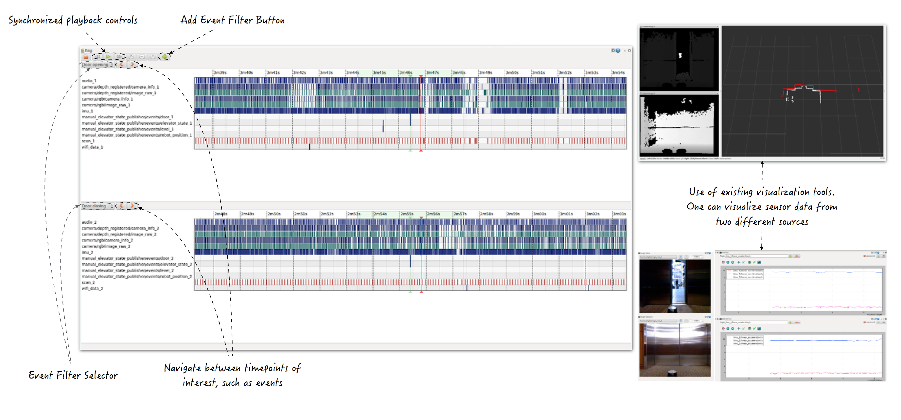

Project Name
===============
Michael Jae-Yoon Chung mjyc@cs.washington.edu



[Poster](https://github.com/CSE512-14W/fp-mjyc/raw/gh-pages/final/poster-mjyc.pdf),
[Final Paper](https://github.com/CSE512-14W/fp-mjyc/gh-pages/master/final/paper-mjyc.pdf)

## Research/Development Process
Initially, I wanted to use my assignment3 as a starting point of the final project.  I wanted to make a web-interface that is capable of displaying on-board sensor data in real-time.  However, I wasn't sure about the main purpose of such visualization tool.  After couple of brainstorming sessions, I concluded that the visualization tool that supports sensor data inspection and comparison would be very useful.  So I started to analyze widely used tools such as [rviz](http://wiki.ros.org/rviz) and [rqt_bag](http://wiki.ros.org/rqt_bag), and tried to improve it to better support sensor data inspection and comparason.

## Running Instructions

My code is heavily relying on [ROS](http://ros.org/).  First, you will need to install [ROS Hydro](http://wiki.ros.org/hydro/Installation) on your machine.  Theoratically, ROS can be installed on various platforms, however, it works the best with Ubuntu platform.  Therefore, I only have tested my code using Ubuntu machines.

Once ROS is installed, you will need to setup your ROS environment as shown [here](http://wiki.ros.org/ROS/Tutorials/InstallingandConfiguringROSEnvironment).  You can now run follow commands from a terminal to build rqt_bag_diff and launch roscore.

```
git clone https://github.com/CSE512-14W/fp-mjyc
cp fp-mjyc/rqt_bag_diff ~/catkin_ws/src/
cd ~/catkin_ws/
catkin_make
roscore
```

Finally run below command to launch rqt_bag_diff from another terminal.

```
python ~/catkin_ws/src/rqt_bag_diff/scripts/rqt_bag_diff
```

You can load any [.bag formatted data](http://wiki.ros.org/Bags) you want to analyze using the load GUI button on the upper-left corner of the interface.  If you don't have any .bag formatted data, you can download the example I used during CSE512 poster session [here]() (WARNING: 13gb file).

Please see the finals paper for the detailed usage explanations.